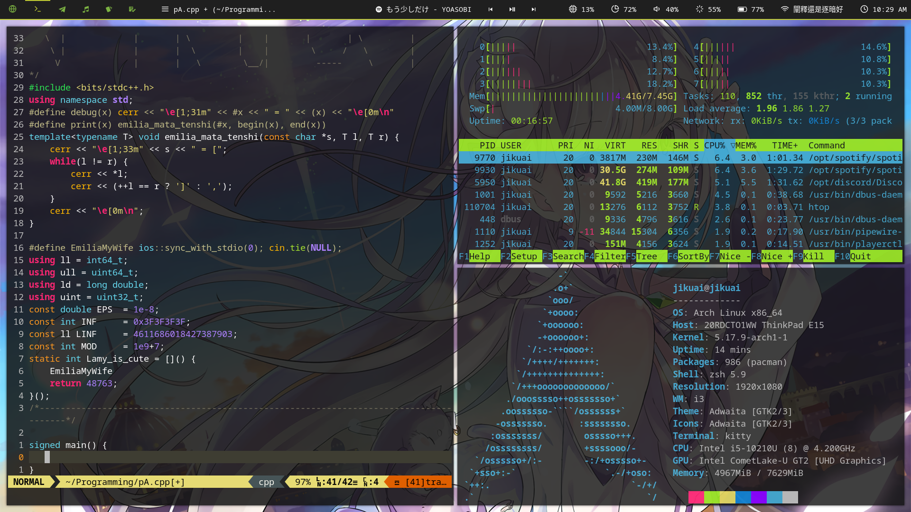

# System
* Distribution: ArchLinux
* Kernel: 5.17.9-arch1-1
* Window Manager: i3-gap
* Compositor: picom
* Status Bar: polybar

# Install
## Install Dependencies
| Name | Description |
| ---- | ----------- |
| polybar | status bar |
| rofi | application launcher |
| mpv | music player |
| kitty | terminal |
| redshift | protect eyes |
| i3-gap | window manager |
| picom | compositor |
| xbindkeys | custom key bindings |
| xbacklight | control backlight |
| thunar | file manager |
| feh | wallpaper & image viewer |
| betterlockscreen | lockscreen |
| xidlehook | auto lock screen |
| pipewire and pipewire-pulse | sound control(Using pulseaudio) |
| scrot | screenshot |

I have installed but I don't know if it is necessary:  
[rofi themes](https://github.com/adi1090x/rofi)  
[polybar themes](https://github.com/adi1090x/polybar-themes)
[polybar spotify](https://github.com/PrayagS/polybar-spotify)

## Run the install script
It should be `$ ./install.sh` but I'm too lazy to write it for now.

## Misc
`:Plug Install` in vim  
`$ zplug install`
